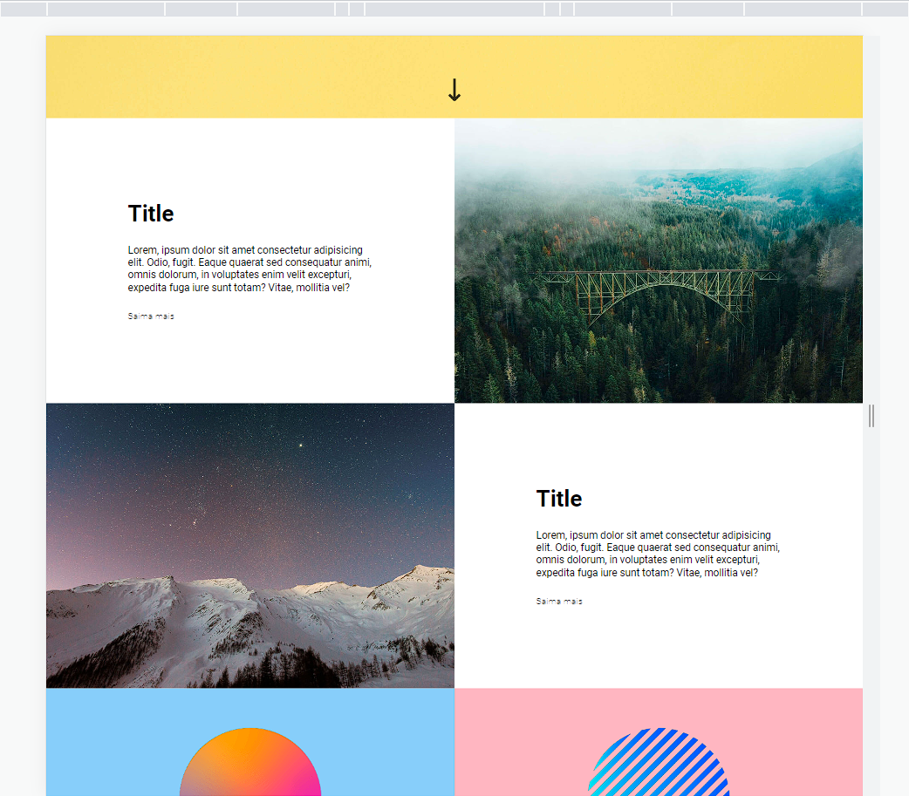

# landing-page-com-grid-agencia-xyz
Initial structure of the Landing Page Project with Grid of the DevQuest course.

project images:
### Screenshot

### Links

- Solution URL: [solution url](https://github.com/julioresende77/Landing-Page-Agencia-XYZ)
- Live Site URL: [website url](https://julioresende77.github.io/Landing-Page-Agencia-XYZ/)

### Built with

- Semantic HTML5 markup
- CSS custom properties
- CSS Grid

## Author

- Website - [Julio Resende]()
- Frontend Mentor - [@julioresende77](https://www.frontendmentor.io/profile/julioresende77)
- Twitter - [@ResendeDev](https://www.twitter.com/ResendeDev)